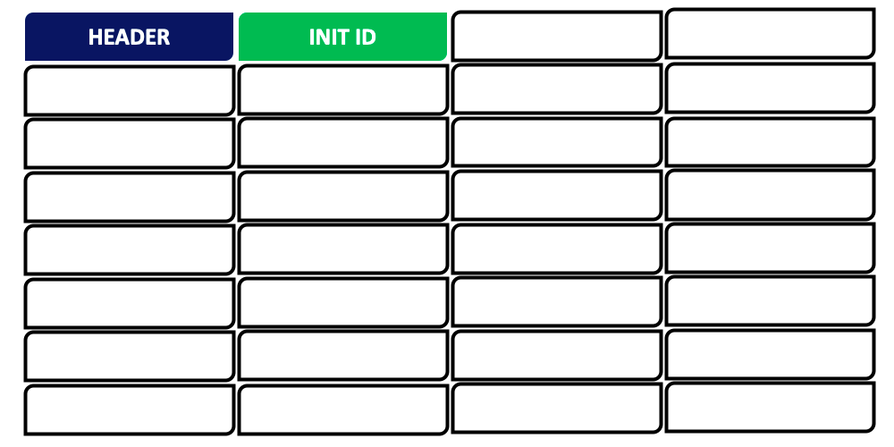
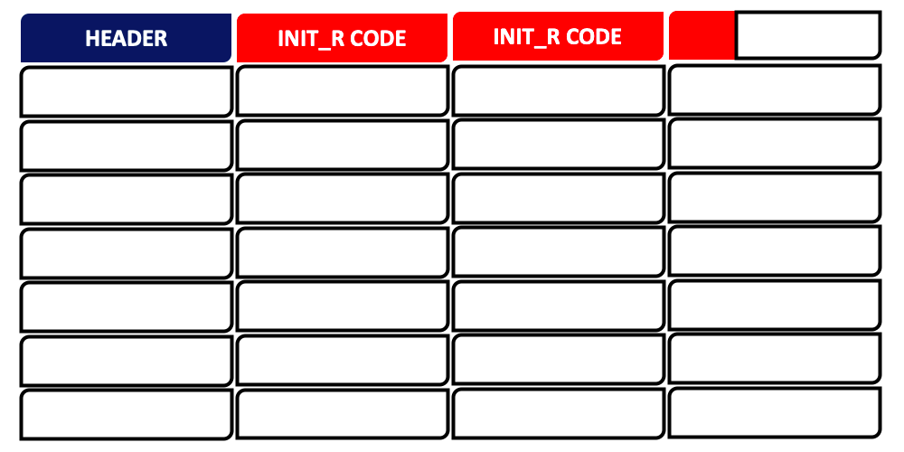
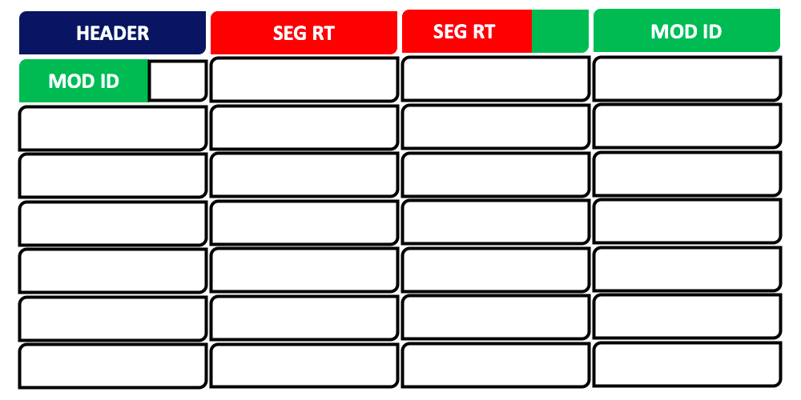
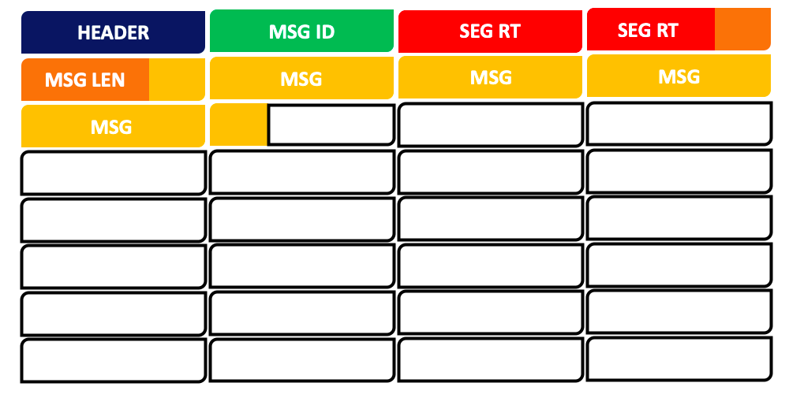
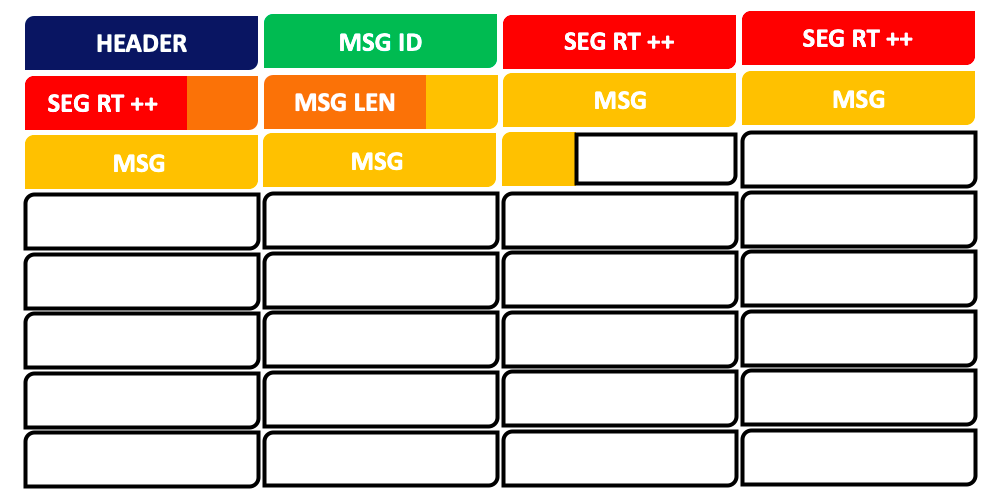
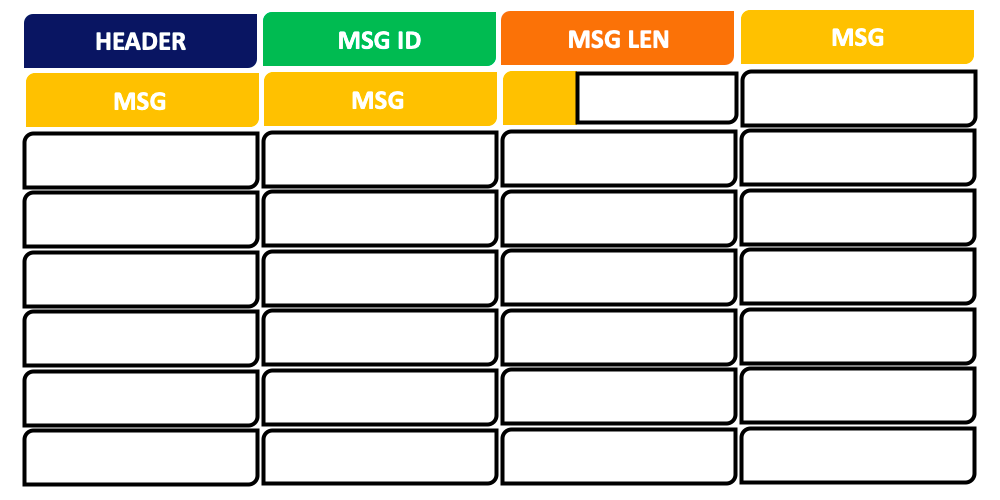

# Documentation Utilisateur

Vous trouverez ici les outils qui vous permettront d'exploiter le protocole de communication. La
documentation est séparée en 2 parties :

1. Les fonctions utiles
2. Les différents types de message

### 1. Les fonctions utiles

Toutes les fonctions des fichiers `galam-robotics-source.hpp` et `galam-robotics-source.cpp` présentent une certaine utilité et sont donc expliquées ci-dessous. Dans les fichiers `galam-robotics-module.h` et `galam-robotics-module.c`, seules les fonctions `Read_Message` et `Send_Error_Message_to_Source` relèvent de la couche applicative et sont expliquées plus bas.

*Attention : Les fonctions décrites ci-dessous sont opérationnelles seulement si la fonction
`Transmit` dans `galam-robotics-source.cpp` a été codée.*

#### Envoi d'un init

```c++
int Send_init(uint8_t init_id)
```

**Fichiers :** `galam-robotics-source.hpp` / `galam-robotics-source.cpp`

**Utilité :** Cette fonction permet d'envoyer un message d'initialisation à tous les modules. Son
utilisation est indispensable pour que la source puisse établir tous les chemins d'accès
vers chaque module grâce au message de retour (init_r) renvoyé par les modules.

**Argument(s) :**
* `uint8_t init_id` est l'identifiant du message d'initialisation. Il doit être différent de 0 et
  d'un éventuel identifiant d'init précédent car cet identifiant permet notamment d'empêcher
  les boucles entre les modules.

**Valeur renvoyée :** La fonction renvoie 0 en cas d'erreur et 1 en cas de succès.

#### Lecture de l'init_r

```c++
void Read_init_r(uint8_t *init_r, std::vector<uint8_t> *segment_routing)
```

**Fichiers :** `galam-robotics-source.hpp` / `galam-robotics-source.cpp`

**Utilité :** Cette fonction doit être appelée après la réception du message de retour
d'initialisation (init_r) pour que les chemins d'accès vers chaque module soient écrits dans
le vecteur `segment_routing`.

**Argument(s) :**
* `uint8_t *init_r` doit correspondre à l'init_r que la source a reçu sans les headers des
  messages (cf. le type de message init_r).
* `std::vector<uint8_t> *segment_routing` est l'adresse d'un tableau de vecteurs où les chemins d'accès vers
  chaque module seront écrits à la fin de l'exécution de la fonction.

**Valeur renvoyée :** Aucune.

#### Envoi d'un message d'identification

```c++
int Send_Message_Identification(uint16_t module_id, std::vector<uint8_t> segment_routing);
```

**Fichiers :** `galam-robotics-source.hpp` / `galam-robotics-source.cpp`

**Utilité :** Cette fonction peut être appelée après la lecture de l'init_r pour identifier
les modules les uns à la suite des autres. L'identification d'un module est très importante
car cela permet de trouver la provenance d'un message qui a été envoyé à la source par un
module.

*Attention : Ne pas identifier tous les modules d'un coup car cela pourrait surcharger le
réseau.*

**Argument(s) :**
* `uint16_t module_id` est l'identifiant que le l'on veut donner au module.
* `std::vector<uint8_t> segment_routing` est le chemin d'accès vers ce module.

**Valeur renvoyée :** La fonction renvoie 0 en cas d'erreur et 1 en cas de succès.

#### Envoi d'un message à un module

```c++
int Send_Message_to_Module(uint8_t *msg, uint8_t length, uint8_t msg_id, std::vector<uint8_t> segment_routing);
```

**Fichiers :** `galam-robotics-source.hpp` / `galam-robotics-source.cpp`

**Utilité :** Cette fonction permet d'envoyer un message à un module

**Argument(s) :**
* `uint8_t *msg` est un tableau d'octets correspondant au message que l'on souhaite envoyer.
* `uint8_t length` est la longueur en octets de ce message.
* `uint8_t msg_id` est l'identifiant que l'on veut donner à ce message. Cela permet entre autres de
  vérifier que le module a bien reçu le message.
* `std::vector<uint8_t> segment_routing` est le chemin d'accès vers le module.

**Valeur renvoyée :** La fonction renvoie 0 en cas d'erreur et 1 en cas de succès.

#### Envoi d'un message à plusieurs modules

```c++
int Send_Message_to_Multiple_Modules(uint8_t *msg, uint8_t length, uint8_t msg_id, std::vector<std::vector<uint8_t>> segment_routings);
```

**Fichiers :** `galam-robotics-source.hpp` / `galam-robotics-source.cpp`

**Utilité :** Cette fonction permet d'envoyer un même message à plusieurs modules.

**Argument(s) :**
* `uint8_t *msg` est un tableau d'octets correspondant au message que l'on souhaite envoyer.
* `uint8_t length` est la longueur en octets de ce message.
* `uint8_t msg_id` est l'identifiant que l'on veut donner à ce message. Cela permet entre autres de
  vérifier que le module a bien reçu le message.
* `std::vector<std::vector<uint8_t>> segment_routings` est un vecteur contenant tous les chemins
  d'accès vers les modules auxquels on souhaite envoyer le message.

**Valeur renvoyée :** La fonction renvoie 0 en cas d'erreur et 1 en cas de succès.

#### Envoi d'un message à tous les modules

```c++
int Send_Message_to_All(uint8_t *msg, uint8_t length, uint8_t msg_id);
```

**Fichiers :** `galam-robotics-source.hpp` / `galam-robotics-source.cpp`

**Utilité :** Cette fonction permet d'envoyer un même message à tous les modules.

**Argument(s) :**
* `uint8_t *msg` est un tableau d'octets correspondant au message que l'on souhaite envoyer.
* `uint8_t length` est la longueur en octets de ce message.
* `uint8_t msg_id` est l'identifiant que l'on veut donner à ce message. Cela permet entre autres de
  vérifier que le module a bien reçu le message.

**Valeur renvoyée :** La fonction renvoie 0 en cas d'erreur et 1 en cas de succès.

#### Lecture d'un message

```c++
void Read_Message(uint8_t msg_id, uint8_t *pData, uint8_t length);
```

**Fichiers :** `galam-robotics-module.h` / `galam-robotics-module.c`

**Utilité :** Cette fonction est appélée lorsque le module a reçu un message de la part de
la source.

**Argument(s) :**
* `uint8_t msg_id` est l'identifiant du message.
* `uint8_t *pData` est un tableau d'octets correspondant au message reçu.
* `uint8_t length` est la longueur en octets du message.

**Valeur renvoyée :** Aucune.

#### Envoi d'un message d'erreur à la source

```c++
void Send_Error_Message_to_Source(uint8_t error_code, uint8_t *error_msg, uint8_t length);
```

**Fichiers :** `galam-robotics-module.h` / `galam-robotics-module.c`

**Utilité :** Cette fonction permet d'envoyer un message d'erreur à la source.

*Attention : cette fonction n'a pas été codé car elle relève de la partie applicative mais est
tout de même utilisée par la couche réseau pour envoyer des erreurs à la source.*

**Argument(s) :**
* `uint8_t error_code` correspond au code d'erreur.
* `uint8_t *error_msg` est un tableau d'octet correspondant au message d'erreur.
* `uint8_t length` est la longueur du message d'erreur.

**Valeur renvoyée :** Aucune.

### 2. Les différents types de message

Il existes 6 types de message :
* *init*
* *init_r*
* *Idenfication Message*
* *Message to Module*
* *Message to Multiple Modules*
* *Message to All*

Leurs constructions sont détaillées ci-dessous.

#### init



L'init est composé de :
* un octet **Header** qui permet de coder :
  * le type de message codé sur les 3 premiers bits, ici c'est *init*.
  * le numéro correspondant à ce sous-message codé sur les 2 bits du milieu.
  * le nombre de sous-message(s) de la transmission codé sur les 3 dernier  bits.
* un octet **Identifiant d'init** pour éviter les boucles dans le réseau.

Le reste des octets est vide.

#### init_r



L'init_r est composé de :
* un octet **Header** qui permet de coder :
  * le type de message codé sur les 3 premiers bits, ici c'est *init_r*.
  * le numéro correspondant à ce sous-message codé sur les 2 bits du milieu.
  * le nombre de sous-message(s) de la transmission codé sur les 3 dernier  bits.
* des bits pour coder les sous-arbres.

Le reste des octets est vide.

#### Identification Message



Les messages d'identification sont composés de :
* un octet **Header** qui permet de coder :
  * le type de message codé sur les 3 premiers bits, ici c'est *Identification Message*.
  * le numéro correspondant à ce sous-message codé sur les 2 bits du milieu.
  * le nombre de sous-message(s) de la transmission codé sur les 3 dernier  bits.
* des bits de **Segment Routing** pour coder le chemin d'accès vers le module destinataire.
* deux octets représentant l'**Identifiant du module**.

Le reste des octets est vide.

#### Message to Module



Les messages destinés à un module sont composés de :
* un octet **Header** qui permet de coder :
  * le type de message codé sur les 3 premiers bits, ici c'est *Message to Module*.
  * le numéro correspondant à ce sous-message codé sur les 2 bits du milieu.
  * le nombre de sous-message(s) de la transmission codé sur les 3 dernier  bits.
* un octet d'**Identifiant de Message**.
* des bits de **Segment Routing** pour coder le chemin d'accès vers le module destinataire.
* un octet pour coder la **Longueur du Message**.
* les bits du **Message**.

Le reste des octets est vide.

#### Message to Multiple Modules



Les messages destinés à un module sont composés de :
* un octet **Header** qui permet de coder :
  * le type de message codé sur les 3 premiers bits, ici c'est *Message to Multiple Modules*.
  * le numéro correspondant à ce sous-message codé sur les 2 bits du milieu.
  * le nombre de sous-message(s) de la transmission codé sur les 3 dernier  bits.
* un octet d'**Identifiant de Message**.
* des bits de **Segment Routing Amélioré** pour coder les chemins d'accès vers les modules destinataires.
* un octet pour coder la **Longueur du Message**.
* les bits du **Message**.

Le reste des octets est vide.

#### Message to All



Les messages destinés à un module sont composés de :
* un octet **Header** qui permet de coder :
  * le type de message codé sur les 3 premiers bits, ici c'est *Message to All*.
  * le numéro correspondant à ce sous-message codé sur les 2 bits du milieu.
  * le nombre de sous-message(s) de la transmission codé sur les 3 dernier  bits.
* un octet d'**Identifiant de Message**.
* un octet pour coder la **Longueur du Message**.
* les bits du **Message**.

Le reste des octets est vide.

