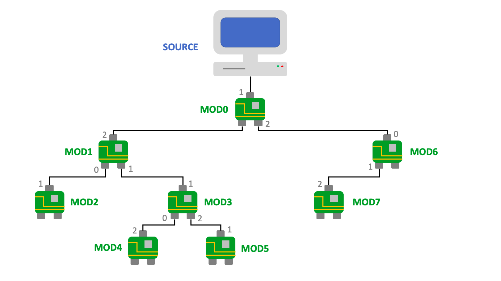

# Projet d'informatique

&nbsp;

<ins>Membres :</ins> Nathan Bertho, Maxime Carenso & Antoine Sion 
<ins>Entreprise :</ins> Galam Robotics 
<ins>Encadrant :</ins> Samuel Perez

### Contexte
Galam Robotics est une entreprise spécialisée dans la robotique modulaire, qui a pour but de 
repenser la logistique urbaine. Pour cela, Galam Robotics a créé une nouvelle solution de 
stockage urbain nommée *TAK-ONE*.

*TAK-ONE* est une aglomération de modules pouvant accueillir des casiers de stockage. Ces 
derniers peuvent se déplacer à travers les modules et ainsi, lorsqu'un certain article rangé 
dans un casier est demander, celui va se mouvoir pour atteindre le réceptionniste.

Les modules peuvent être assimilés à des cartes électronique possédant chacune 3 interfaces de
connection numérotées de 0 à 2. Ces dernières sont reliées entre elles de manière aléatoire 
mais de manière à ce qu’il y ait toujours un chemin de la source vers chaque module. Cela 
permet de s’assurer que l’on peut trouver un arbre couvrant. Ci-dessous se trouve un exemple 
de configuration de modules. 

### Sujet
Notre travail a consisté, dans un premier temps, à concevoir un protocole de communication
permettant à la source de communiquer avec les modules et inversement, puis dans un second
temps, de l'implémenter en C (en un fichier qui serait destiné à être éxécuté sur la carte 
électronique de chaque module) et enfin de tester le code en simulant virtuellement des modules.

Pour cela, nous devions trouver un moyen pour que la source prenne connaissance de l'arbre des 
modules, ce qui fut accompli par une phase d'initialisation. Ensuite, nous avons dû développer 
le protocole de communication en lui-même et ce en déterminant comment les messages allait
être construit et comment il seront acheminés à destination.

En ce qui concerne le fichier C à coder, nous devions programmer les fonctions dont nous avions
besoin pour gérer la réception d'un message à la carte électronique du module.

### Résultats
Les fichiers `galam-robotics-module.c` et `galam-robotics-module.h` constituent le résultat du
projet. 
Les fichiers `galam-robotics-source.cpp` et `galam-robotics-source.hpp` pourront aussi être
utilisés du côté de la source.

La documentation client `DOC_USER.md` regroupe les informations nécessaires pour exploiter le
protocole de communication.

Vous pourrez trouver dans le dossier `tests/` les fichiers qui permettent de simuler
virtuellement des modules ainsi qu'un jeu de tests pour un exemple.
